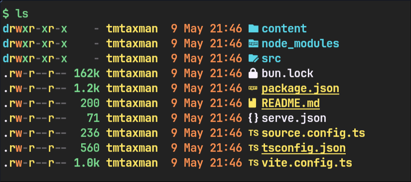
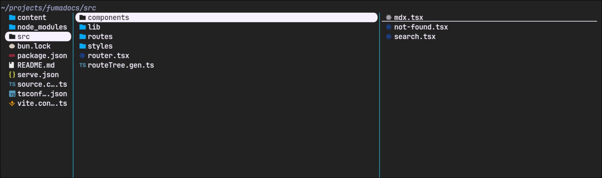
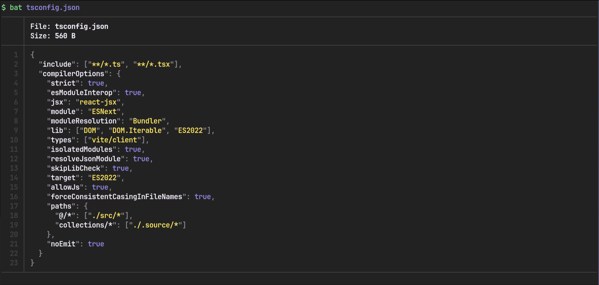
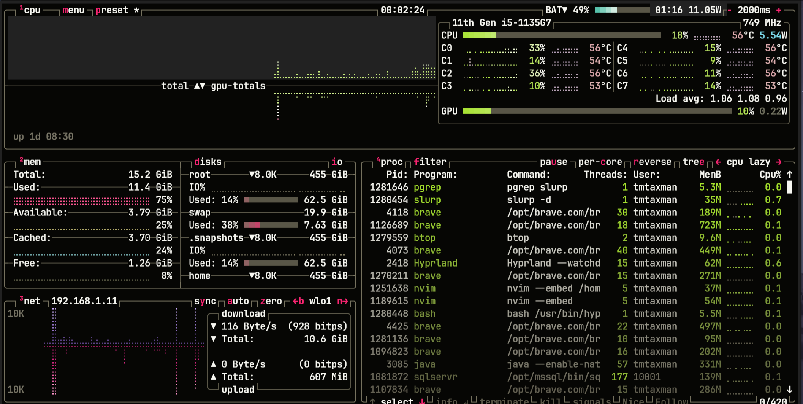
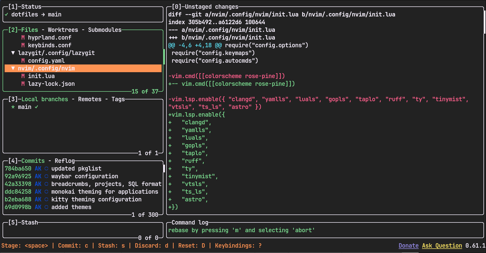

## Introduction
I spend a large part of my day in the terminal. Therefore, it's essential that I have a fast and feature rich experience. To achieve this, I use several tools that greatly enhance my workflow. Today, I'll be listing several of these tools here such that you may take inspiration from them and also achieve a better terminal workflow.

## Terminal Emulator 
Before we discuss these command line tools, let's discuss the terminal emulator of my choice which is [Kitty](https://github.com/kovidgoyal/kitty).
I've tried many other terminals such as Alacritty, Wezterm and Ghostty but I've always come back to Kitty. It's very performant, has great theming and customization and renders my fonts the best (in my opinion). I will be writing an article on kitty soon with my preferred configuration. Stay tuned for it.

Now let's talk about the various command line tools I use.

### Eza
The first and most common one is [`eza`](https://github.com/eza-community/eza). It's a modern replacement for `ls` and I use it tens of times a day.
I have `ls` aliased to `eza --long --color=always --icons=always --group-directories-first`.
This command lists directories first if any and then the files in the directory. It includes icons next to the files and folders and also has colors.


It can be installed on Arch Linux from the `extra` repository.
```sh
yay -S eza
```

### Yazi
[`yazi`](https://yazi-rs.github.io) is a blazing fast terminal file manager. I use it to browse my files, copy or move them, delete them etc.
It supports previews for images, works with vim keybindings, displays the file information of audio/video files and is fully featured. I use it as my main file manager rarely needing a graphical file manager.

It can be installed on Arch Linux from the `extra` repository.
```sh
yay -S yazi
```

### Bat
[`bat`](https://github.com/sharkdp/bat) is a clone of the `cat` command written in Rust. However, it's not just a clone of cat.
It supports syntax highlighting out of the box for many programming and markup languages. It can also act as a pager such as `less`. 
and is my preferred pager program. It can be set as the default pager by adding the following line to your `~/.bashrc` or `~/.zshrc` depending on the shell you use.
```sh
# ~/.zshrc
export PAGER=bat --plain
```




It can be installed on Arch Linux from the `extra` repository.
```sh
yay -S bat
```

### Btop
[`btop`](https://github.com/aristocratos/btop) is a complete and comprehensive system/process monitor. It can display your CPU performance, GPU performance, memory and disk usage, your currently running processes, system temperatures and battery information along with your network activity. Whenever I need to check up on anything whether it be system temps, killing a hanging process or basic CPU monitoring when doing performance intensive tasks, `btop` is my first choice.



It can be installed on Arch Linux from the `extra` repository.
```sh
yay -S btop
```

### Lazygit
[`lazygit`](https://github.com/jesseduffield/lazygit) is a terminal UI for git commands. Whenever I'm using git, I use it through `lazygit`. Whether it be committing code, amending commits or looking at diffs, this is my favorite. It makes working with git extremely nice and while I can and do use the `git` CLI commands, `lazygit` just makes it all so much easier.



It can be installed on Arch Linux from the `extra` repository.
```sh
yay -S lazygit
```

## Conclusion
These were some of my most used terminal tools. There are also others for which I may write an article about in the future.
I hope you try out some of these tools and integrate them into your workflow.
Thanks for reading. Goodbye.
